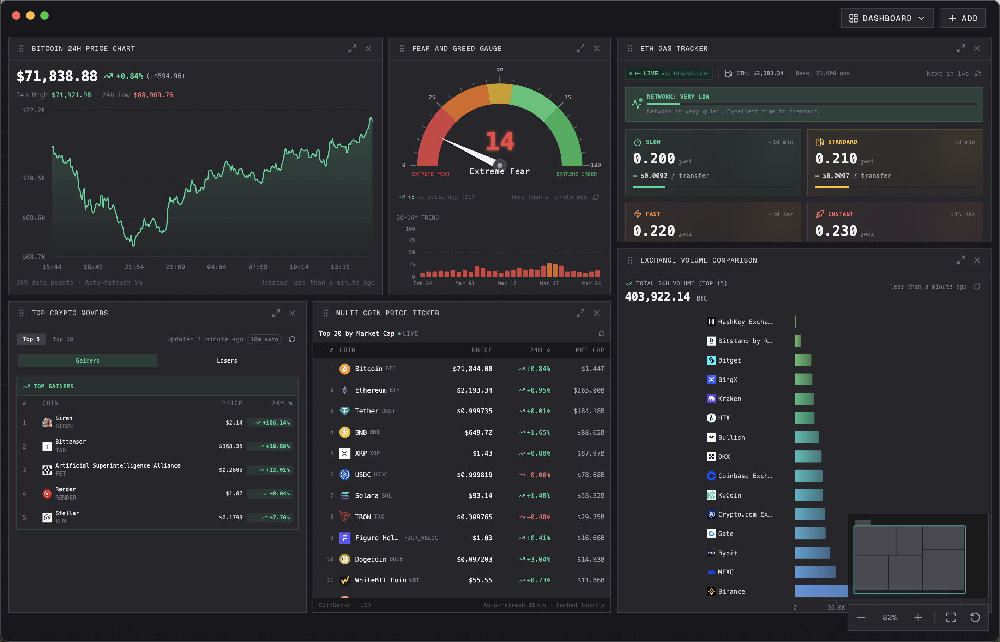
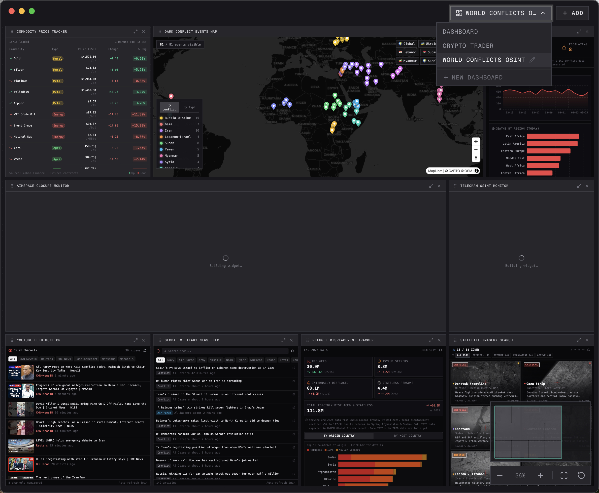
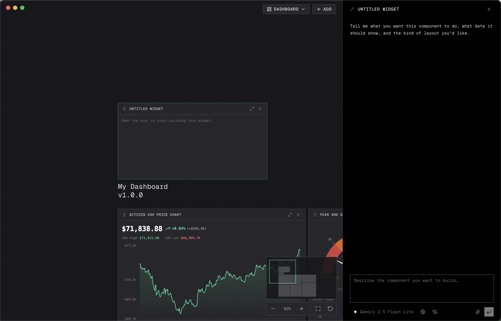
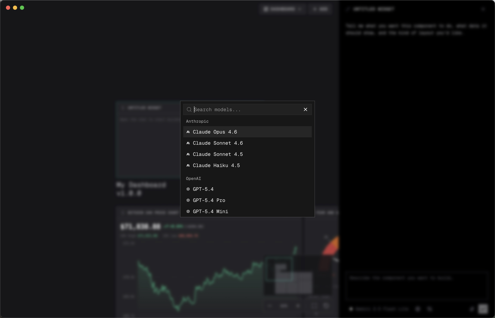
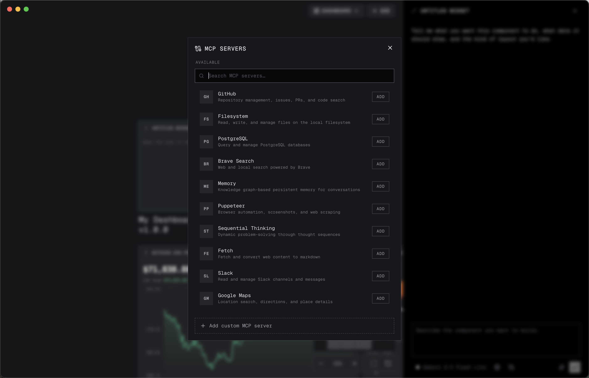
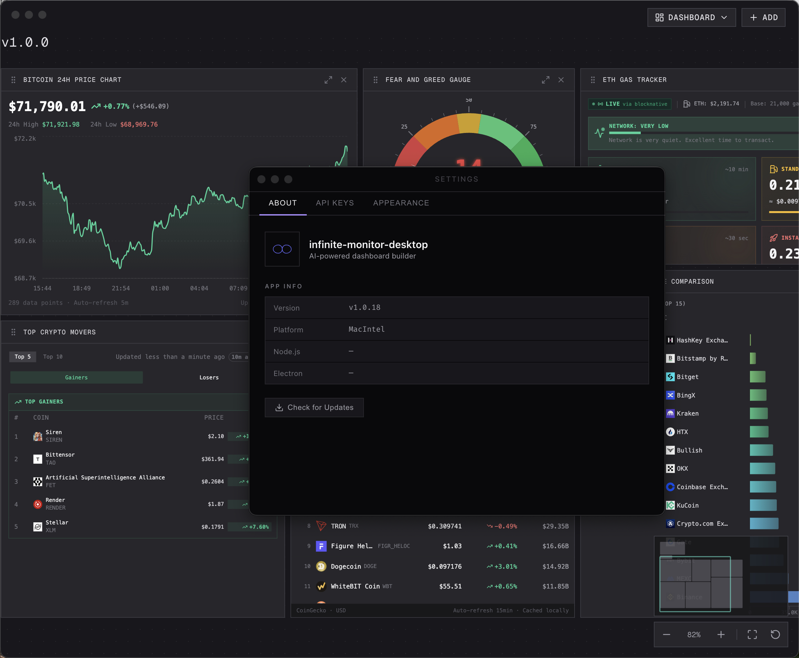
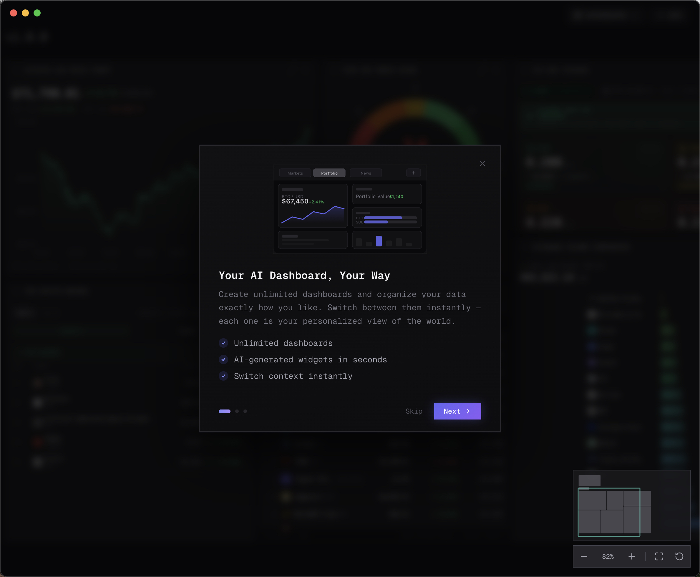
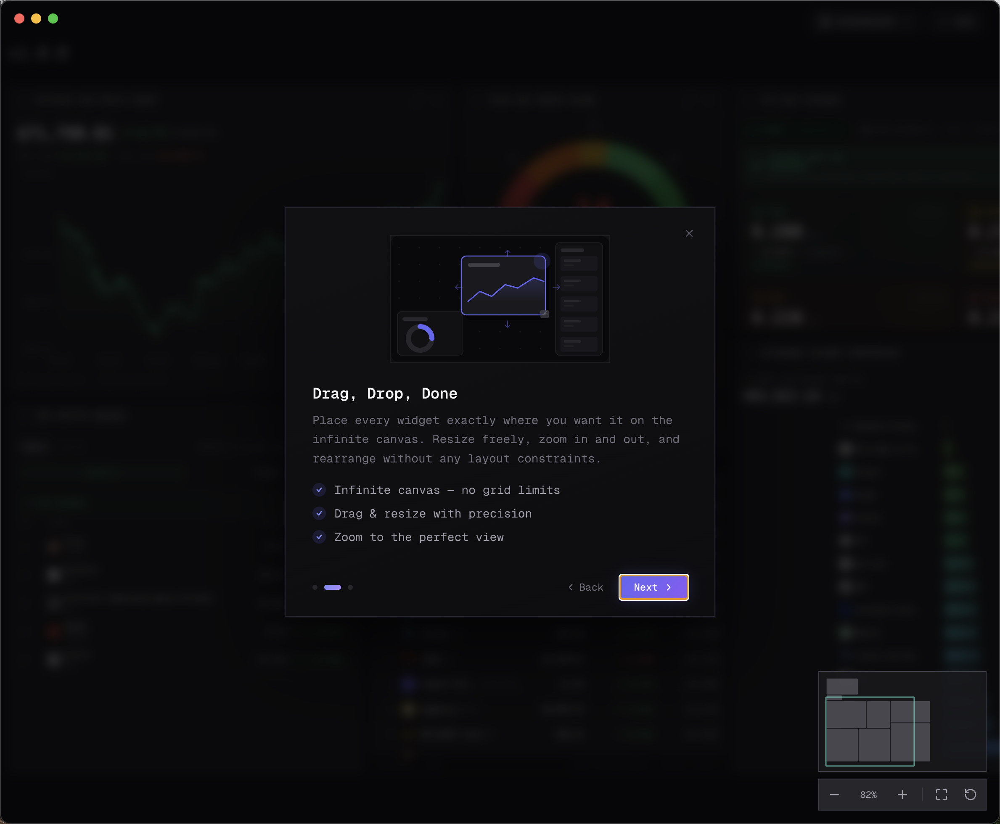
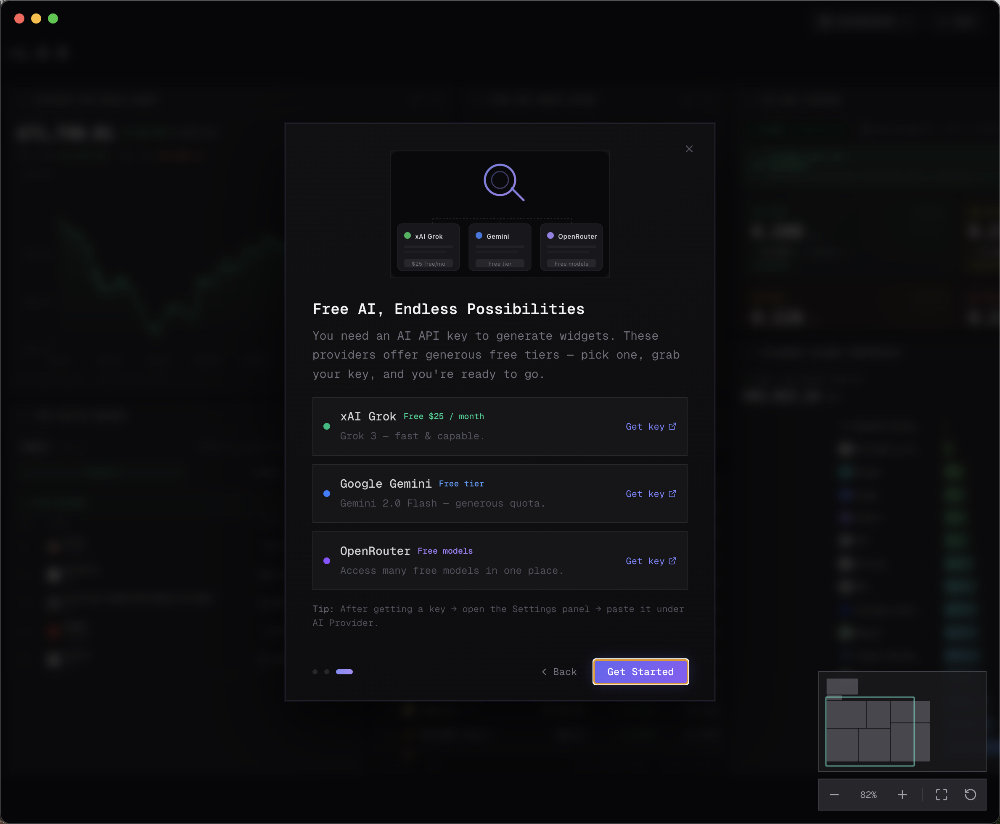

# Infinite Monitor

### Your AI Dashboard, Yours to Own

Build powerful AI-powered dashboards that monitor crypto, markets, news, and anything else — running entirely on your machine, offline-capable, no cloud required.

 

---

## Screenshots

<table>
  <tr>
    <td width="33%"> <b>Multiple Dashboards</b> — Create unlimited dashboards and switch instantly</td>
    <td width="33%"> <b>Add Widgets</b> — AI-powered widgets with one click</td>
    <td width="33%"> <b>AI Model Selection</b> — Choose from xAI Grok, Google Gemini, OpenRouter & more</td>
  </tr>
  <tr>
    <td width="33%"> <b>MCP Integration</b> — Model Context Protocol for advanced AI workflows</td>
    <td width="33%"> <b>Settings</b> — Manage API keys, themes, and preferences</td>
    <td width="33%"> <b>Onboarding</b> — Guided intro to get started fast</td>
  </tr>
  <tr>
    <td width="33%"> <b>Drag & Drop Canvas</b> — Arrange widgets freely on an infinite canvas</td>
    <td width="33%"> <b>Free AI Providers</b> — Connect to free AI services with your own keys</td>
    <td width="33%"></td>
  </tr>
</table>

---

## Features

### 🤖 AI-Powered Widgets
Connect to **free AI providers** — xAI Grok, Google Gemini, OpenRouter, or any custom API. Build widgets that analyze data, generate charts, track markets, and respond intelligently.

### 🧠 Built-in AI Chat Sidebar
Chat with AI directly inside the app. Ask questions, get analysis, and generate new widgets — all without leaving your dashboard.

### 🔗 MCP Integration (Model Context Protocol)
Use the **Model Context Protocol** to connect widgets to advanced AI workflows, external tools, and web search capabilities.

### ♾️ Infinite Canvas with Drag & Drop
An unlimited canvas where you can **drag, drop, resize, and zoom** widgets freely. Pixel-perfect arrangement with smooth 60fps experience.

### 📊 Multiple Dashboards
Create **unlimited dashboards** for different use cases — crypto trading, news monitoring, project tracking — and switch between them instantly.

### 📡 Real-Time Data Monitoring
Monitor **crypto prices, stock markets, RSS feeds, weather, and any custom API** — all updating live on your dashboard.

### 📝 Text Blocks & Annotations
Add **text annotations** anywhere on your canvas. Write notes, labels, or documentation right next to your widgets.

### 📦 Template Gallery
Get started fast with **pre-built dashboard templates** — Crypto Trader, Market Watch, News Feed, and more. One click to apply.

### 🔌 Works Offline
The built-in **Service Worker** caches up to **200 MB** of data for 30 days. Your dashboard keeps working even when the internet doesn't.

### 🔒 Private by Design
Everything runs **locally** on your machine. No accounts, no cloud sync, no tracking, no telemetry. Your data stays yours. Period.

### 🖥️ Native Desktop Experience
Built with Electron — **macOS traffic-light controls**, native keyboard shortcuts (`Cmd+Shift+W` to add widget, `Cmd+N` for new dashboard), system menu integration, and frameless window design.

### 🌐 Cross-Platform
Available for **macOS** (Intel & Apple Silicon), **Windows** (x64), and **Linux** (AppImage & .deb).

### 🔑 API Key Management
Manage all your AI provider keys from a dedicated **Settings panel**. Add, edit, and remove keys for OpenAI, Anthropic, Google, xAI, and custom providers.

### 🔄 Auto-Updates & Diagnostics
Built-in **update checker** and **API diagnostics** to ensure everything is working perfectly. Real-time connection status and error recovery.

### 🎓 Guided Onboarding
A beautiful **3-slide onboarding flow** introduces new users to all features. Can be replayed anytime from the Help menu.

---

## Download

**[⬇ Download the latest release](https://github.com/mehdiraized/infinite-monitor-desktop/releases/latest)** — free, no sign-up required.

| Platform | Format |
|----------|--------|
| **macOS** (Intel & Apple Silicon) | `.dmg`, `.zip` |
| **Windows** (x64) | `.exe` installer |
| **Linux** (x64) | `.AppImage`, `.deb` |

Or [build from source](CONTRIBUTING.md) if you prefer.

---

## Roadmap

We're just getting started. Here's what's coming next:

### 🧠 AI Optimization — *Coming Soon*
A **$5/month subscription** that gives all users access to optimized AI for building and improving widgets effortlessly — no API keys needed, just describe what you want.

### 🗄️ Advanced Widgets — *Coming Soon*
Widgets are going beyond just displaying information. Future widgets will have their own **database structures**, **API endpoints**, and the ability to **communicate with other devices** — turning your dashboard into a full-featured platform.

### 📤 Import & Export Widgets — *Coming Soon*
**Export** your widgets and dashboards to share with others, or **import** community-created widgets with a single click.

### 🏪 Widget Marketplace — *Coming Soon*
A **marketplace** where users can **share, discover, and even sell** their widgets. Plus a curated collection of **Pro widgets** available to subscribers.

### 💎 Pro Subscription Plan — *Coming Soon*
Subscribe to unlock **Pro widgets**, access the marketplace, and use **free AI credits** for widget creation — all in one plan. The best way to get the most out of Infinite Monitor.

---

## Website

Visit the landing page for more info and downloads:

🌐 **[mehdiraized.github.io/infinite-monitor-desktop](https://mehdiraized.github.io/infinite-monitor-desktop/)**

---

## Support the Project

If you find Infinite Monitor useful, consider supporting its development:

---

## Contributing

We welcome contributions! See **[CONTRIBUTING.md](CONTRIBUTING.md)** for the full development guide covering:

- Setting up the development environment
- How the overlay system works
- Building for production
- Releasing new versions
- Architecture overview

---

## Credits

Built on top of the amazing [Infinite Monitor](https://github.com/homanp/infinite-monitor) by [@homanp](https://github.com/homanp).

---

## License

[MIT](LICENSE) — open source, free forever.
